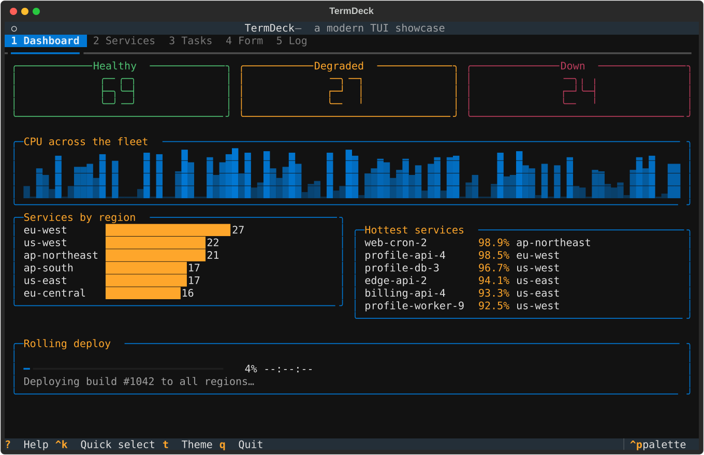
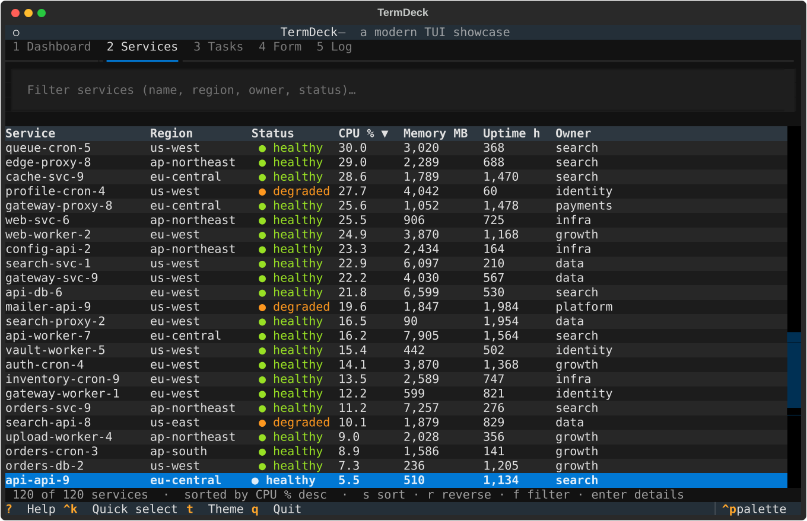
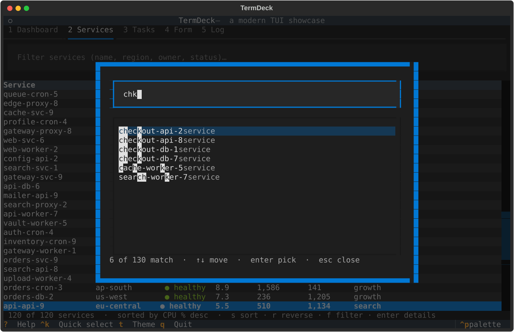
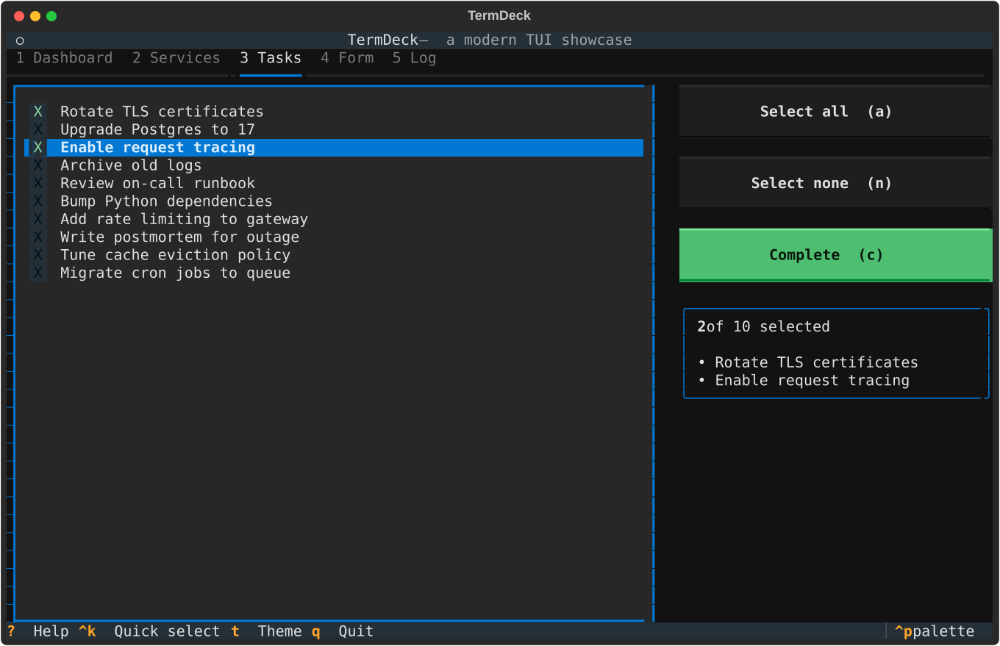
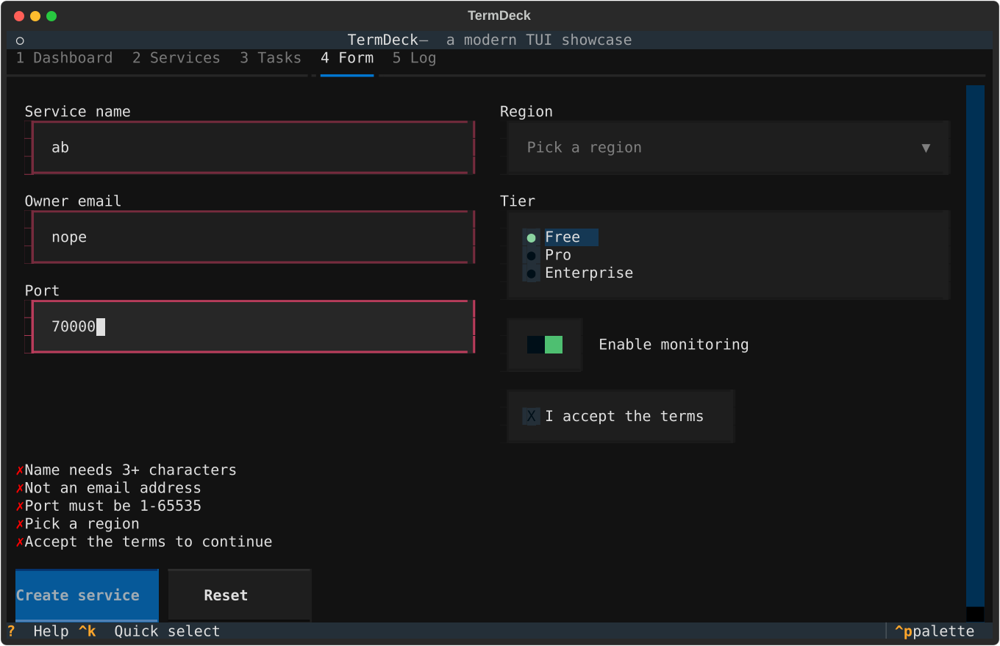
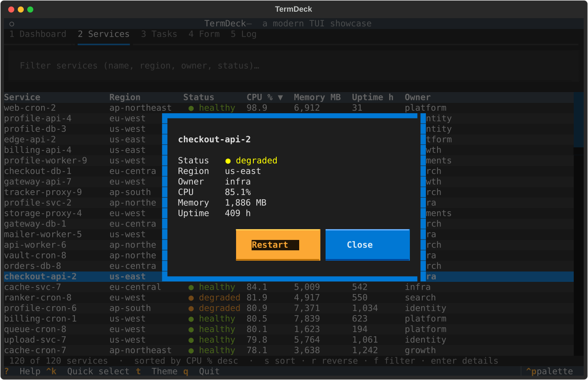
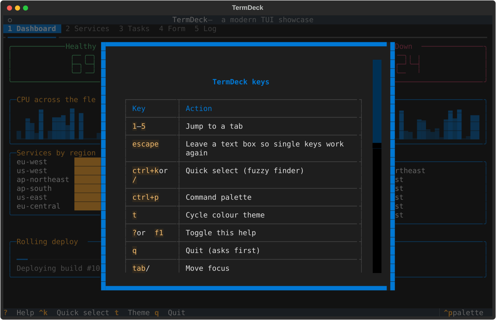
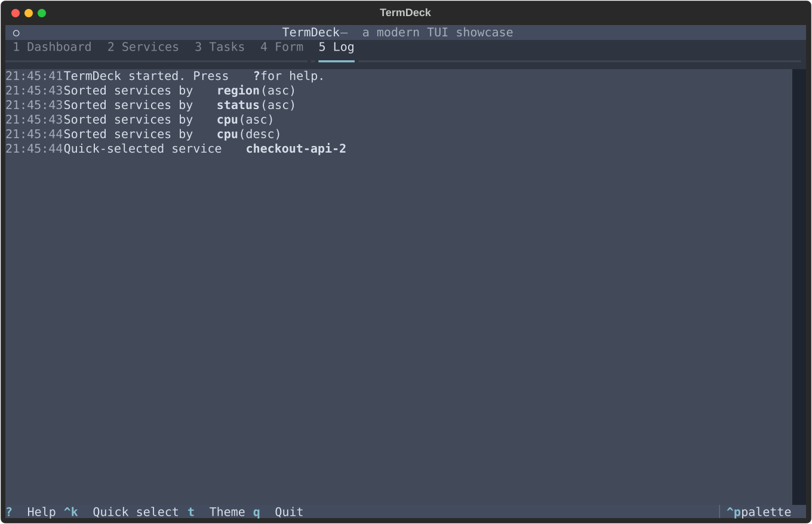

# TermDeck

TermDeck is a small terminal app that tours the building blocks of a modern TUI. It pretends to be
an ops console for a fleet of 120 fake services, which gives every widget something real to do.

Built with **Python** and **[Textual](https://textual.textualize.io/)** (v8), the most popular
Python TUI framework. Textual gives you CSS-styled layouts, mouse support, themes and a headless test
pilot out of the box.



## What it shows

| TUI staple | Where to find it |
| --- | --- |
| Tabs | Five tabs across the top. Switch with `1`–`5` or the mouse. |
| Sortable, scrollable table | **Services** tab. `s` cycles the sort column, `r` reverses, or click a header. |
| Live filter | **Services** tab. `f` focuses the filter box; the table narrows as you type. |
| Quick select / fuzzy finder | `ctrl+k` or `/` anywhere. Type a few letters (`chk` finds `checkout-*`), `enter` jumps there. |
| Multi-select list | **Tasks** tab. `space` toggles, `a` selects all, `n` selects none. |
| Confirm modal | Completing tasks (`c`) and quitting (`q`) both ask first. |
| Detail modal | Press `enter` on a table row. |
| Form with validation | **Form** tab: text inputs with validators, dropdown select, radio set, switch, checkbox. |
| Help overlay | `?` or `f1`. Rendered from Markdown. |
| Command palette | `ctrl+p` (built into Textual), with fuzzy search over app commands. |
| Theming | `t` cycles themes (Nord, Gruvbox, Tokyo Night, Dracula, Catppuccin, light themes…). |
| Toast notifications | Shown after actions like submitting the form or restarting a service. |
| Dashboard widgets | Big digits, sparkline, bar charts and an animated progress bar. |
| Event log | **Log** tab records what you did, with timestamps. |
| Context-aware footer | Footer key hints update with the active tab and focused widget. |

## Run it

Requires Python 3.10+.

```bash
cd TermDeck
python -m venv .venv
source .venv/bin/activate        # Windows: .venv\Scripts\activate
pip install -e ".[dev]"
termdeck                         # or: python -m termdeck
```

Tip: if you are typing in a text box, press `escape` to leave it so single-key shortcuts work again.

For live CSS reloading while you tweak the look, install `textual-dev` and run
`textual run --dev termdeck.app:TermDeckApp`.

## Test it

The tests drive the real app headlessly with Textual's `Pilot`: pressing keys, reading the table,
opening modals and submitting the form.

```bash
pytest
```

## Screenshots

| | |
| --- | --- |
|  |  |
|  |  |
|  |  |

The log tab in the Nord theme:



Screenshots are SVGs exported by Textual itself (`app.export_screenshot()`).

## Project layout

```
TermDeck/
├── termdeck/
│   ├── app.py        # the App: tabs, table, tasks, form, bindings, theming
│   ├── screens.py    # modal screens: help, confirm, fuzzy quick select, details
│   ├── data.py       # deterministic fake services and tasks
│   └── app.tcss      # Textual CSS for layout and colours
├── tests/test_app.py # headless Pilot tests
└── docs/             # screenshots
```
